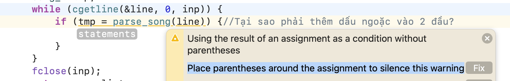

# Tổng hợp lưu ý

### Thêm dấu ngoặc vào `if((tmp = parse_song(line))) `

file:  [baitap5-1.c]("../5. Danh sách liên kết/baitap5-1.c") 

Tương đương với `if( (tmp = parse_song(line)) != NULL)`

Ans: [StackOverFlow](https://stackoverflow.com/questions/5476759/compiler-warning-suggest-parentheses-around-assignment-used-as-truth-value)

